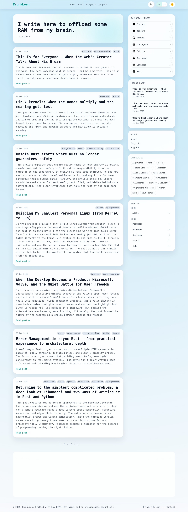

# Visited: https://drunkleen.com

**Time:** 2026-05-15 15:42:57 UTC

## Favicon

## Screenshot

## Raw HTML
[page.html](./page.html)

## Downloaded Media (20 files)
- [0260812_favicon.ico](./media/0260812_favicon.ico) (90 KB)

## Other Links
- [${item.url}](${item.url})
- [/](/)
- [/?page=2](/?page=2)
- [/about](/about)
- [/archive/2025/07](/archive/2025/07)
- [/archive/2025/08](/archive/2025/08)
- [/archive/2025/09](/archive/2025/09)
- [/archive/2025/11](/archive/2025/11)
- [/archive/2025/12](/archive/2025/12)
- [/archive/2026/04](/archive/2026/04)
- [/categories/Algorithms](/categories/Algorithms)
- [/categories/Async](/categories/Async)
- [/categories/Book](/categories/Book)
- [/categories/Command-Line_Tools](/categories/Command-Line_Tools)
- [/categories/Education](/categories/Education)
- [/categories/Linux_%26_Servers](/categories/Linux_%26_Servers)
- [/categories/Open-Source](/categories/Open-Source)
- [/categories/Operating&#43;Systems](/categories/Operating&#43;Systems)
- [/categories/Permissions](/categories/Permissions)
- [/categories/Philosophic](/categories/Philosophic)
- [/categories/Privacy_%26_Security](/categories/Privacy_%26_Security)
- [/categories/Programming&#43;Concepts](/categories/Programming&#43;Concepts)
- [/categories/Python](/categories/Python)
- [/categories/Rust](/categories/Rust)
- [/categories/Self-Hosting](/categories/Self-Hosting)
- [/cdn-cgi/l/email-protection#fd8e939c8d98bd998f88939691989893d39e9290](/cdn-cgi/l/email-protection#fd8e939c8d98bd998f88939691989893d39e9290)
- [/cdn-cgi/scripts/5c5dd728/cloudflare-static/email-decode.min.js](/cdn-cgi/scripts/5c5dd728/cloudflare-static/email-decode.min.js)
- [/contact](/contact)
- [/feed](/feed)
- [/feed-fa](/feed-fa)
- [/posts/fibonacci-problem](/posts/fibonacci-problem)
- [/posts/linux-kernels-when-the-names-multiply-adbd-meaning-gets-lost](/posts/linux-kernels-when-the-names-multiply-adbd-meaning-gets-lost)
- [/posts/my-own-smallest-linux-ever-made](/posts/my-own-smallest-linux-ever-made)
- [/posts/rust-async-error-handling-2](/posts/rust-async-error-handling-2)
- [/posts/this-is-for-everyone-when-the-web%27s-creator-talks-about-his-dream](/posts/this-is-for-everyone-when-the-web%27s-creator-talks-about-his-dream)
- [/posts/unsafe-rust-starts-where-rust-no-longer-guarantees-safety](/posts/unsafe-rust-starts-where-rust-no-longer-guarantees-safety)
- [/posts/when-the-desktop-becomes-a-product](/posts/when-the-desktop-becomes-a-product)
- [/privacy](/privacy)
- [/projects](/projects)
- [/static/css/tailwind.css](/static/css/tailwind.css)
- [/static/js/htmx.min.js](/static/js/htmx.min.js)
- [/support](/support)
- [https://discord.gg/k8bPTR7Yuc](https://discord.gg/k8bPTR7Yuc)
- [https://drunkleen.com/](https://drunkleen.com/)
- [https://github.com/drunkleen](https://github.com/drunkleen)
- [https://pagead2.googlesyndication.com/pagead/js/adsbygoogle.js?client=ca-pub-8557573804858508](https://pagead2.googlesyndication.com/pagead/js/adsbygoogle.js?client=ca-pub-8557573804858508)
- [https://techhub.social/@drunkleen](https://techhub.social/@drunkleen)
- [https://www.instagram.com/drunkleen/](https://www.instagram.com/drunkleen/)
- [https://www.linkedin.com/in/drunkleen/](https://www.linkedin.com/in/drunkleen/)
- [https://www.youtube.com/@drunkleen](https://www.youtube.com/@drunkleen)

## Stats
- Total links: 70
- Media downloaded: 20
